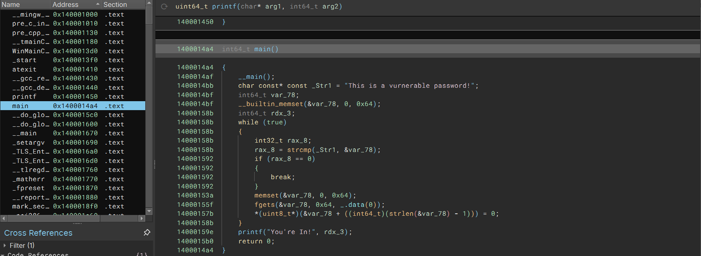

### What I've Learned

- Dissasembler
    - Dissasembler is used to decompile a compiled program. We can use dissasembler like IDA or Binary Ninja.

- Easy Vulnerability
    - If you just put a password that is a constant variable, it can be pretty easy for hackers to just decompile the program and see the password.
    - Here is a screenshot of what i've done, i just dissasembled the binary and scan it with binary ninja
    - 
