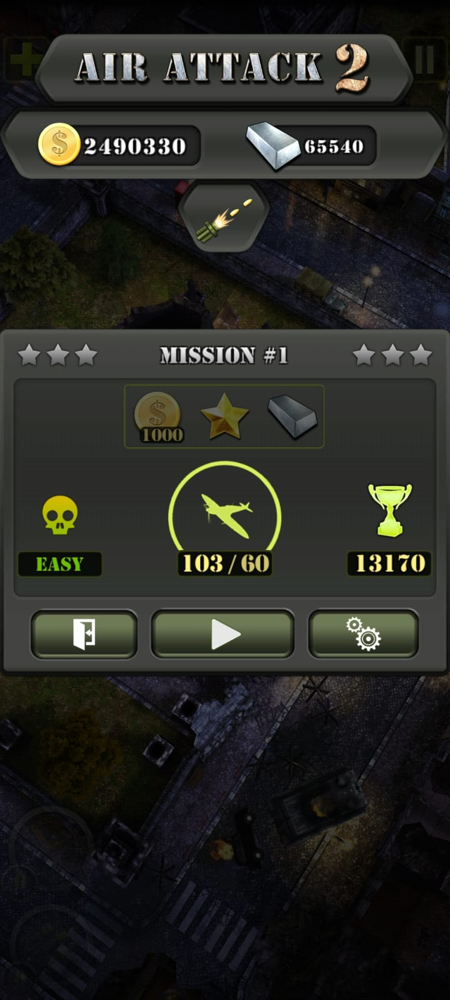
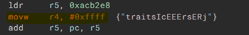

### What I've learned

- Binary Analysis
    - I've learn some pretty basic things about reverse engineering and how to modify the binaries. Turns out its quite easy to reverse engineer a unity game, even if its backend is il2cpp. But of course if it is obfuscated, it will be pretty hard to analyze what the fuction does.

- Screenshots
    - I've reverse engineered my favorite offline game. With respect of the game developers i will the details on how to reverse engineered it, just the screenshots of what the compiled reverse engineered app looked like.
    - 
    - But i could show just one example of changing the binaries
    - 
    - In this screenshot i've changed the binaries on some offset that takes an argument and move it into a register. I've changed it so that the register value don't take the argument, and instead take an immediate value that is very high. I've changed it from `mov r4, r0` to `movw r4, #0xffff`.
    - This result is valid, from the game screenshot you can see that the ingots have gone up to 65535, which is 0xffff. The initial is 5, and after i finished the level i got 1 ingot, resulting in 65540
    - There are other things that I've changed but i will not state it.
